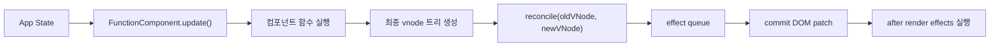
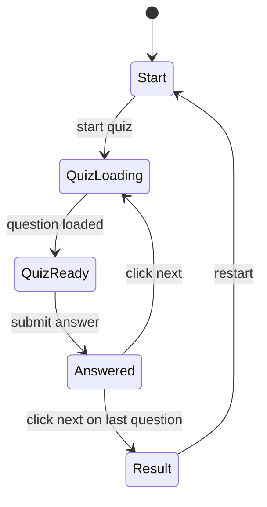

# WEEK5 아키텍처 - Mini React Dog Breed Quiz

이 문서는 [`requirements.md`](./requirements.md)를 구현하기 위한 설계 기준입니다.  
목표는 WEEK4의 `Virtual DOM + Diff + Patch` 엔진을 재사용하면서, 그 위에 `Mini React runtime`과 `Dog Breed Quiz` 앱을 얹는 것입니다.

## 1. 아키텍처 원칙

- 기존 WEEK4 엔진은 `vnode 생성/비교/반영` 책임만 유지한다.
- WEEK5에서는 그 앞단에 `FunctionComponent 기반 runtime`을 추가한다.
- 상태는 `App` 루트 컴포넌트에서만 관리한다.
- 자식 컴포넌트는 모두 stateless pure function으로 유지한다.
- 함수형 컴포넌트는 diff 대상으로 직접 넣지 않고, 렌더 시 일반 `element/text vnode`로 해석한 뒤 엔진에 전달한다.
- 이벤트는 문자열 속성이 아니라 함수형 props를 기준으로 실제 DOM에 바인딩한다.

## 2. 전체 구조



전체 시스템은 크게 네 층으로 나눕니다.

1. `Mini React Runtime`
2. `VDOM / Diff / Patch Engine`
3. `Dog Breed Quiz App`
4. `API / Utility / Test`

## 3. 레이어별 책임

### 3.1 Mini React Runtime

Runtime는 함수형 컴포넌트를 실행하고 Hook 상태를 유지하며 rerender를 트리거하는 계층입니다.

주요 책임:

- `FunctionComponent` 인스턴스 생성
- `hooks[]`와 `hookIndex` 관리
- `mount()`와 `update()` 제공
- 현재 실행 중인 컴포넌트 추적
- `useState`, `useEffect`, `useMemo` 구현
- render 이후 effect 실행 스케줄링

### 3.2 VDOM / Diff / Patch Engine

이 계층은 WEEK4 코드를 최대한 재사용합니다.

주요 책임:

- vnode 생성/정규화
- 이전 vnode와 다음 vnode 비교
- effect queue 생성
- 실제 DOM에 필요한 변경만 반영
- keyed diff 유지
- 이벤트 props 변경 시 리스너 교체 지원

### 3.3 Dog Breed Quiz App

앱 계층은 오직 화면 구성과 상태 전이만 담당합니다.

주요 책임:

- 시작 화면, 퀴즈 화면, 결과 화면 렌더링
- 문제 수 선택
- 문제 생성과 정답 판정
- 입력값 관리
- 정답/오답 피드백
- 다음 문제 이동
- 최종 점수 계산

### 3.4 API / Utility / Test

주요 책임:

- Dog CEO API 호출
- breed 목록 평탄화
- 문제 생성
- 정답 문자열 정규화
- 단위 테스트와 통합 시나리오 테스트

## 4. Runtime 설계

### 4.1 FunctionComponent

모든 함수형 컴포넌트는 `FunctionComponent` 인스턴스로 감싸서 실행합니다.

예상 책임:

- `componentFn`
- `props`
- `container`
- `hooks`
- `hookIndex`
- `currentVNode`
- `pendingEffects`
- `isMounted`

예상 메서드:

- `mount()`
  - 최초 렌더링 수행
  - vnode 생성
  - 실제 DOM 마운트
  - effect 실행
- `update()`
  - `hookIndex` 초기화
  - 컴포넌트 함수 재실행
  - 새 vnode 생성
  - 이전 vnode와 diff
  - patch 반영
  - effect 실행

### 4.2 Runtime 전역 상태

Hook은 현재 실행 중인 컴포넌트를 알아야 하므로 runtime에는 최소한 아래 전역 문맥이 필요합니다.

```js
let currentComponent = null;
```

렌더 흐름:

1. `FunctionComponent.mount()` 또는 `update()` 시작
2. `currentComponent = this`
3. `hookIndex = 0`
4. 컴포넌트 함수 실행
5. vnode 생성 완료
6. `currentComponent = null`

### 4.3 Hook 동작 방식

#### `useState`

- 현재 `FunctionComponent`의 `hooks[hookIndex]`를 읽는다.
- 초기 렌더에서만 초기값을 저장한다.
- setter 호출 시 해당 hook 값을 갱신한다.
- 값 갱신 후 루트 `update()`를 호출한다.

#### `useEffect`

- 현재 `hookIndex` 위치에 `{ deps, cleanup }` 정보를 저장한다.
- 이전 deps와 비교해 실행 여부를 결정한다.
- render 중 바로 실행하지 않고 `pendingEffects`에 등록한다.
- patch 완료 후 effect를 실행한다.
- 재실행 전 이전 cleanup을 먼저 호출한다.

#### `useMemo`

- 현재 `hookIndex` 위치에 `{ deps, value }`를 저장한다.
- deps가 같으면 기존 값을 재사용한다.
- deps가 바뀌면 새 값을 계산해 저장한다.

## 5. vnode 해석 전략

기존 WEEK4 엔진은 `root`, `element`, `text` 중심입니다.  
따라서 함수형 컴포넌트는 별도 vnode 타입으로 commit하지 않고, 렌더 시점에 바로 일반 vnode로 펼칩니다.

예시 흐름:

```js
App(props)
-> QuizScreen(props)
-> QuizImage(props)
-> 최종 element/text vnode 트리
```

즉, diff 엔진은 컴포넌트를 직접 모르고, 최종 vnode만 비교합니다.

이 전략의 장점:

- 기존 WEEK4 코드를 많이 재사용할 수 있다.
- commit 단계 복잡도를 크게 늘리지 않는다.
- Hook과 rerender 책임을 runtime에 집중시킬 수 있다.

## 6. 이벤트 처리 설계

WEEK4 엔진은 문자열 속성 보존은 가능하지만 함수형 이벤트 핸들러는 직접 처리하지 않습니다.  
WEEK5에서는 vnode attrs에 함수형 이벤트를 허용하고 DOM 반영 시 별도로 처리합니다.

### 이벤트 처리 규칙

- `onClick`, `onInput`, `onChange`, `onSubmit` 같은 props를 지원한다.
- 이벤트 prop 값이 함수면 DOM 속성으로 넣지 않고 리스너로 연결한다.
- mount 시 `addEventListener`를 호출한다.
- update 시 이전 핸들러와 새 핸들러를 비교한다.
- 핸들러가 바뀌면 이전 리스너를 제거하고 새 리스너를 등록한다.
- 핸들러가 제거되면 기존 리스너도 제거한다.

### DOM 이벤트 저장 방식

각 DOM 노드에는 현재 연결된 이벤트 핸들러를 추적할 수 있는 내부 저장소가 필요합니다.

예시:

```js
element.__handlers = {
  click: fn,
  input: fn,
};
```

이 저장소를 기준으로 update 시 교체 여부를 판단합니다.

## 7. 앱 상태 아키텍처

모든 상태는 `App` 루트에서 관리합니다.

### 권장 상태 구조

```js
{
  phase: 'start', // 'start' | 'quiz' | 'result'
  totalQuestions: 5,
  currentQuestionIndex: 0,
  breedList: [],
  currentQuestion: null,
  userAnswer: '',
  feedback: null, // 'correct' | 'wrong' | null
  score: 0,
  isLoading: false,
  error: null
}
```

### `currentQuestion` 구조

```js
{
  id: 'q-3',
  answer: {
    key: 'bulldog-french',
    breed: 'bulldog',
    subBreed: 'french',
    label: 'French Bulldog'
  },
  imageUrl: 'https://images.dog.ceo/...',
}
```

## 8. 화면 구조

```text
App
├── StartScreen
├── QuizScreen
│   ├── ScoreBoard
│   ├── QuizImage
│   ├── AnswerForm
│   └── FeedbackPanel
└── ResultScreen
```

### StartScreen

- 문제 수 선택
- 시작 버튼

### QuizScreen

- 현재 문제 번호
- 현재 점수
- 강아지 이미지
- 답 입력칸
- 제출 버튼
- 정답/오답 피드백
- 피드백 표시 후 다음 버튼 노출

### ResultScreen

- 총 점수
- 정답률
- 다시 하기 버튼

## 9. 상태 전이 설계



### 전이 규칙

- `start -> quiz`
  - breed 목록이 준비되어 있으면 첫 문제 로드 시작
- `quiz loading -> quiz ready`
  - 이미지 요청 성공 시 문제 표시
- `quiz ready -> answered`
  - 제출 버튼 클릭 시 정답 판정
- `answered -> next quiz`
  - 다음 버튼 클릭 시, 마지막 문제가 아니면 다음 문제 로드
- `answered -> result`
  - 다음 버튼 클릭 시, 마지막 문제면 결과 화면 이동
- `result -> start`
  - 전체 상태 초기화

## 10. 문제 생성 및 정답 판정 설계

### 10.1 breed 평탄화

Dog CEO API의 `breeds/list/all` 응답을 아래 구조로 평탄화합니다.

```js
{
  key: 'pug',
  breed: 'pug',
  subBreed: null,
  label: 'Pug'
}
```

또는

```js
{
  key: 'bulldog-french',
  breed: 'bulldog',
  subBreed: 'french',
  label: 'French Bulldog'
}
```

### 10.2 문제 생성 흐름

1. `breedList`에서 정답 후보 1개 선택
2. 정답 후보 기준으로 이미지 API 요청
3. 이미지 URL을 받아 `currentQuestion` 생성
4. 입력칸 초기화
5. 피드백 초기화

### 10.3 정답 판정 규칙

입력값은 그대로 비교하지 않고 정규화 후 비교합니다.

정규화 예시:

- trim 적용
- 소문자 변환
- 연속 공백 제거
- 하이픈/공백 차이 최소화

예시:

- `"French Bulldog"`
- `" french bulldog "`
- `"french-bulldog"`

위 입력은 같은 정답으로 처리할 수 있게 설계합니다.

## 11. 비동기 처리 설계

### 11.1 초기 breed 목록 로드

- `App.mount()` 이후 `useEffect([])`에서 1회 실행
- 성공 시 `breedList` 저장
- 실패 시 `error` 저장

### 11.2 문제 로드

- `phase === 'quiz'`
- `breedList.length > 0`
- `currentQuestion === null` 또는 다음 문제 진입 시
- 위 조건에서 새 문제를 생성

### 11.3 늦은 응답 방지

질문 전환 중 이전 요청이 늦게 도착해도 현재 문제를 덮어쓰지 않도록 요청 식별자를 둡니다.

예시:

```js
let activeRequestId = 0;
```

문제 로드 시작 시:

1. `requestId` 증가
2. 요청 시작
3. 응답 도착 시 현재 `requestId`와 비교
4. 다르면 무시

## 12. 제출 처리 설계

제출은 반드시 단일 함수에서 처리합니다.

예시:

```js
function submitAnswer() {}
```

책임:

- 현재 입력값 읽기
- 중복 제출 방지
- 정답 판정
- 점수 반영
- 피드백 상태 반영

중복 제출 방지 규칙:

- 이미 `feedback !== null`이면 다시 채점하지 않는다.

제출과 다음 문제 이동은 별도 액션으로 처리합니다.

전환 책임:

- 제출 시
  - 현재 입력값 읽기
  - 중복 제출 방지
  - 정답 판정
  - 점수 반영
  - 피드백 상태 반영
- 다음 버튼 클릭 시
  - 마지막 문제 여부 판단
  - 다음 문제 인덱스로 이동 또는 결과 화면 이동
  - 입력값/피드백 초기화

## 13. 파일 구조 제안

```text
docs/
  requirements.md
  architecture.md

mini-react-dom-diff/
  src/lib/
    vdom.js
    fiber/

dog-breed-quiz/
  index.html
  src/
    mini-react/
      index.js
      component.js
      hooks.js
      renderer.js
      event.js
      vdom.js
      diff.js
      patch.js
    components/
      StartScreen.js
      QuizScreen.js
      ScoreBoard.js
      QuizImage.js
      AnswerForm.js
      FeedbackPanel.js
      ResultScreen.js
    services/
      api.js
    domain/
      quiz.js
      normalize.js
    app.js
    main.js
  styles/
    main.css
  tests/
    mini-react.test.js
    events.test.js
    quiz.test.js
```

## 14. 모듈별 책임

### `src/mini-react/component.js`

- `FunctionComponent` 클래스
- `mount()`
- `update()`

### `src/mini-react/hooks.js`

- `useState`
- `useEffect`
- `useMemo`
- `currentComponent` 접근

### `src/mini-react/renderer.js`

- 루트 컴포넌트 시작
- 컴포넌트 실행
- 최종 vnode 반환

### `src/mini-react/event.js`

- 이벤트 props 판별
- DOM 이벤트 등록/해제
- 핸들러 교체

### `src/services/api.js`

- breed 목록 요청
- 견종별 이미지 요청

### `src/domain/quiz.js`

- breed 평탄화
- 랜덤 정답 선택
- 문제 객체 생성
- 정답 판정

### `src/domain/normalize.js`

- 사용자 입력 정규화
- 정답 문자열 비교 규칙 관리

## 15. 테스트 아키텍처

### Runtime 테스트

- `FunctionComponent.mount()`가 초기 렌더를 수행하는지
- `FunctionComponent.update()`가 새 vnode를 생성하고 patch까지 호출하는지
- `useState`가 값 유지와 rerender를 보장하는지
- `useEffect`가 deps 비교와 cleanup을 수행하는지
- `useMemo`가 캐싱되는지

### Event 테스트

- `onClick`, `onInput`, `onSubmit`가 DOM 이벤트에 연결되는지
- rerender 시 핸들러가 교체되는지
- 제거된 핸들러가 정상 해제되는지

### Quiz 테스트

- `flattenBreeds`
- `normalizeAnswer`
- `isCorrectAnswer`
- `buildQuestion`

### Flow 테스트

- 시작
- 문제 로드
- 입력
- 제출
- 피드백 표시
- 다음 문제
- 결과 화면
- 다시 하기

## 16. 구현 순서 권장안

1. WEEK4 엔진을 WEEK5 폴더 구조로 복사 또는 래핑한다.
2. `FunctionComponent`와 Hook runtime을 구현한다.
3. vnode 렌더와 update 흐름을 연결한다.
4. 이벤트 바인딩 계층을 추가한다.
5. `App` 루트 상태와 화면 컴포넌트를 구현한다.
6. Dog CEO API 연동과 문제 생성 로직을 붙인다.
7. 테스트를 추가한다.
8. README와 발표 자료를 정리한다.

## 17. 핵심 결정 요약

- 컴포넌트는 diff 엔진이 직접 처리하지 않고 렌더 시 일반 vnode로 해석한다.
- Hook 상태는 `FunctionComponent` 인스턴스의 `hooks[]`에 저장한다.
- 상태는 루트 `App`에서만 관리한다.
- 퀴즈는 객관식이 아니라 주관식 입력 기반으로 구현한다.
- 제출 후 피드백을 표시하고, 다음 버튼 클릭으로 다음 문제 또는 결과 화면으로 이동한다.
- 제한시간은 두지 않는다.
- 기존 WEEK4 엔진은 최대한 유지하되, 이벤트 처리만 WEEK5에서 확장한다.
