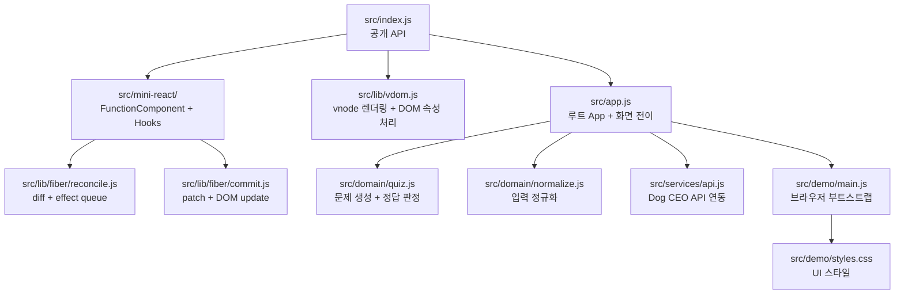
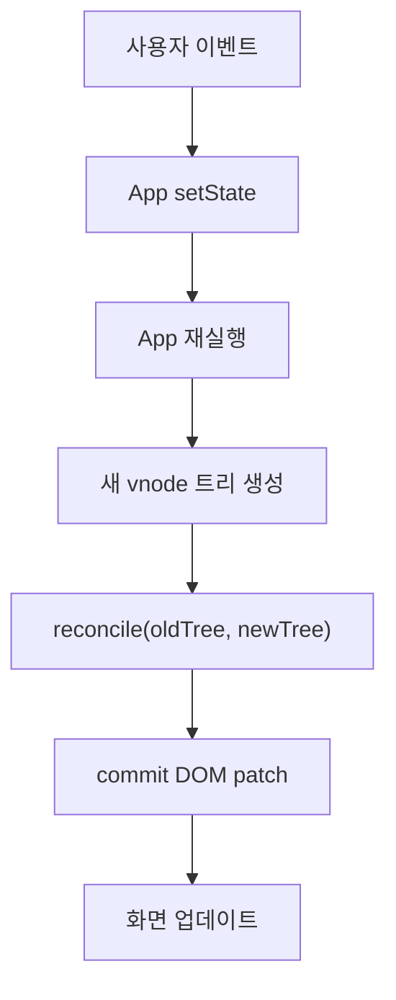
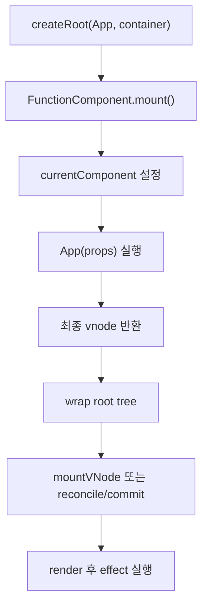
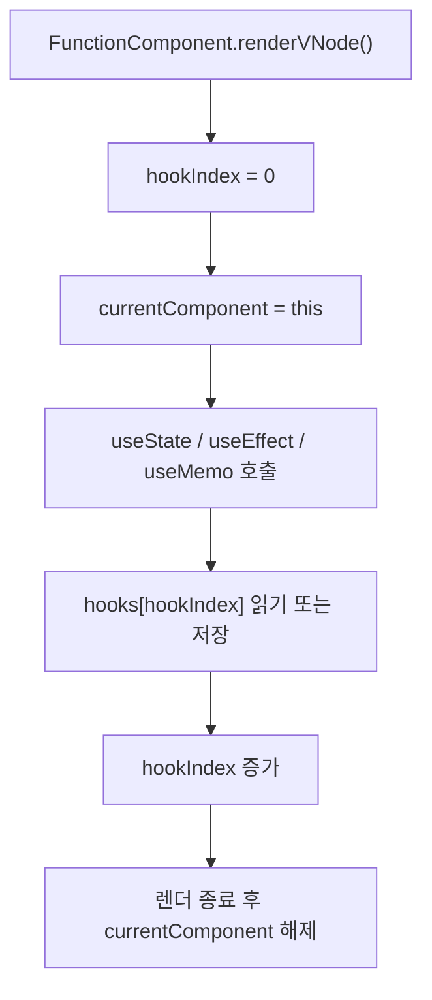
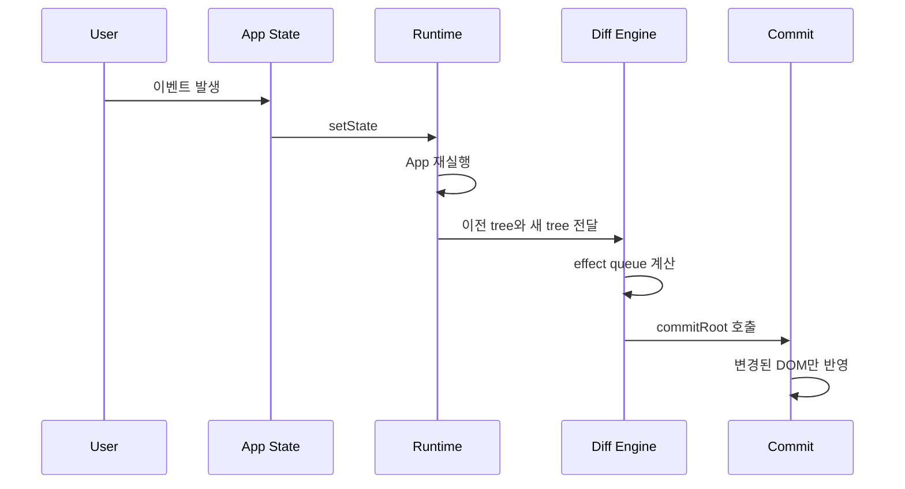

# Mini React Dog Breed Quiz

WEEK4에서 만든 `Virtual DOM + Diff + Patch` 엔진을 재사용해서, 함수형 컴포넌트와 Hook 기반의 `Mini React runtime`을 올리고 그 위에 `Dog Breed Quiz` 앱을 구현한 프로젝트입니다.

이 프로젝트의 목표는 두 가지입니다.

- React와 비슷한 사용 경험을 아주 작은 런타임으로 직접 구현해보는 것
- 상태 변경 시 `rerender -> diff -> patch` 흐름이 실제 앱에서 어떻게 동작하는지 확인하는 것

## 프로젝트 범위

- `FunctionComponent` 기반의 Mini React runtime
- `useState`, `useEffect`, `useMemo` 최소 구현
- 함수형 이벤트 props 지원
- WEEK4 VDOM / Fiber diff / commit 엔진 재사용
- Dog CEO API 기반 Dog Breed Quiz 앱

## 주요 기능

- 시작 화면에서 문제 수 선택
- 견종 목록 로드 후 퀴즈 시작
- 강아지 이미지와 입력창 기반 주관식 퀴즈
- 제출 후 정답/오답 피드백 표시
- 다음 버튼으로 다음 문제 또는 결과 화면 이동
- 결과 화면에서 점수와 정답률 표시
- 다시 하기로 초기 상태 복귀

## 실행 방법

```bash
cd mini-react-dom-diff
npm install
npm run dev
```

브라우저에서 Vite가 안내하는 로컬 주소를 열면 앱을 볼 수 있습니다.

## 테스트 방법

```bash
cd mini-react-dom-diff
npm test
```

현재 테스트 범위는 아래를 포함합니다.

- Mini React runtime
- Hook 동작
- VDOM diff / patch
- 이벤트 연결 및 갱신
- Quiz 도메인 로직
- App 전체 흐름

## 데모 흐름

1. 앱이 시작되면 견종 목록을 불러옵니다.
2. 시작 화면에서 문제 수를 선택합니다.
3. `퀴즈 시작`을 누르면 문제 이미지가 로드됩니다.
4. 정답을 입력하고 `제출`을 누르면 정답/오답 피드백이 표시됩니다.
5. `다음 문제` 또는 `결과 보기` 버튼으로 진행합니다.
6. 결과 화면에서 점수와 정답률을 확인하고 `다시 하기`를 누르면 처음으로 돌아갑니다.

## 구조

```text
src/
  app.js
  mini-react/
    component.js
    hooks.js
    index.js
    renderer.js
  lib/
    vdom.js
    fiber/
      reconcile.js
      commit.js
      flags.js
  domain/
    normalize.js
    quiz.js
  services/
    api.js
  demo/
    main.js
    styles.css
tests/
  mini-react.test.js
  vdom.test.js
  quiz.test.js
  app.test.js
```

## 시스템 구조

아래 구조도는 현재 프로젝트가 어떤 레이어로 나뉘어 있는지 보여줍니다.



### 레이어별 책임

- `src/mini-react`
  - 함수형 컴포넌트 실행
  - Hook 상태 저장
  - mount / update / unmount 처리
- `src/lib`
  - vnode 생성, diff, patch, commit
- `src/domain`
  - 입력 정규화, 문제 생성, 정답 판정
- `src/services`
  - Dog CEO API 호출과 응답 정규화
- `src/app.js`
  - 루트 상태와 화면 전이

## WEEK4 엔진 재사용 방식

WEEK5에서 새로 만든 것은 “컴포넌트와 상태를 다루는 런타임”이고, DOM 변경 계산과 반영 엔진은 WEEK4 코드를 재사용했습니다.

- `src/lib/vdom.js`
  - vnode 렌더링과 DOM 속성 처리
- `src/lib/fiber/reconcile.js`
  - 이전/다음 트리 비교
- `src/lib/fiber/commit.js`
  - effect queue를 실제 DOM에 반영

Mini React runtime은 컴포넌트를 실행해 최종 vnode를 만든 뒤, 이 엔진에 넘겨 변경된 부분만 실제 DOM에 반영합니다.

## 상태 흐름

모든 앱 상태는 루트 `App`에서만 관리합니다. 자식 화면은 별도 local state를 가지지 않고 `props`만 받아 렌더합니다.



루트 상태 예시는 아래와 같습니다.

- `phase`
- `totalQuestions`
- `currentQuestionIndex`
- `breedList`
- `currentQuestion`
- `userAnswer`
- `feedback`
- `score`
- `isLoading`
- `error`

## 컴포넌트 흐름

함수형 컴포넌트는 JSX 대신 최종 vnode 객체를 반환합니다. 런타임은 각 컴포넌트를 `FunctionComponent` 인스턴스로 감싸 실행합니다.



핵심 계약은 아래와 같습니다.

- 컴포넌트는 `root`, `element`, `text` vnode만 반환합니다.
- 상태 변경은 `setState`가 루트 `update()`를 호출합니다.
- `destroy()` / `unmount()`는 effect cleanup 후 DOM을 비웁니다.

## Hook 구현 원리

Hook은 전역의 `currentComponent`와 각 컴포넌트 인스턴스의 `hooks[]`, `hookIndex`를 이용해 동작합니다.



### `useState`

- 최초 렌더에서만 초기값을 저장합니다.
- 이후에는 같은 `hookIndex`의 값을 재사용합니다.
- setter가 호출되면 값을 갱신하고 `component.update()`를 호출합니다.

### `useEffect`

- deps를 비교해 재실행 여부를 결정합니다.
- effect는 렌더 중 즉시 실행하지 않고 `pendingEffects`에 큐잉합니다.
- DOM patch가 끝난 뒤 실행합니다.
- deps가 바뀌거나 unmount되면 기존 cleanup을 먼저 실행합니다.

### `useMemo`

- deps가 같으면 이전 계산 결과를 재사용합니다.
- deps가 바뀌면 factory를 다시 실행해 새 값을 저장합니다.

## `rerender -> diff -> patch` 흐름

이 프로젝트의 핵심은 상태가 바뀌어도 전체 DOM을 매번 새로 그리지 않는다는 점입니다.



즉, 상태 변경의 결과는 아래 순서로 이어집니다.

1. `setState`
2. 루트 컴포넌트 재실행
3. 새 vnode 생성
4. 이전 vnode와 diff
5. 필요한 effect만 commit
6. effect 실행

## 실제 React와의 차이

이 프로젝트는 React의 핵심 아이디어를 학습하기 위한 최소 구현입니다. 실제 React와는 아래 차이가 있습니다.

- JSX transform이 없습니다.
  - 직접 vnode 객체를 반환합니다.
- Fiber scheduler가 없습니다.
  - 우선순위 기반 스케줄링이나 concurrent rendering이 없습니다.
- Hook 종류가 제한적입니다.
  - `useState`, `useEffect`, `useMemo`만 구현했습니다.
- 컴포넌트 트리 전체를 정교하게 추적하지 않습니다.
  - 루트 함수형 컴포넌트를 다시 실행하고 최종 host vnode를 diff합니다.
- React synthetic event 시스템이 없습니다.
  - DOM `addEventListener` 기반으로 직접 연결합니다.

즉, React와 동일한 완성도보다는 “React가 내부에서 해결하는 문제를 작은 코드로 직접 이해하는 것”에 초점을 둡니다.

## 테스트 포인트

- `tests/mini-react.test.js`
  - Hook 상태 유지
  - effect deps / cleanup
  - memo 캐싱
  - unmount cleanup
- `tests/vdom.test.js`
  - 텍스트/속성 변경
  - 자식 삽입/삭제
  - keyed 이동
  - 이벤트 핸들러 patch
- `tests/quiz.test.js`
  - breed 평탄화
  - 입력 정규화
  - 문제 생성
  - 정답 판정
- `tests/app.test.js`
  - 시작 -> 제출 -> 피드백 -> 다음 -> 결과 흐름
  - 늦은 비동기 응답 무시
  - cleanup 이후 stale response 무시

## 한계와 후속 개선 아이디어

- 함수형 컴포넌트 중첩 해석은 최소 범위만 지원합니다.
- Hook 종류가 제한적입니다.
- 에러 경계나 스케줄링 같은 고급 기능은 없습니다.
- 지금 구조는 학습용 / 팀 프로젝트용 단순성에 맞춰져 있습니다.

그럼에도 이 프로젝트는 작은 런타임으로도 실제 앱을 구성할 수 있고, 상태 변경이 DOM 변경으로 이어지는 과정을 직접 추적할 수 있다는 점에서 의미가 있습니다.
